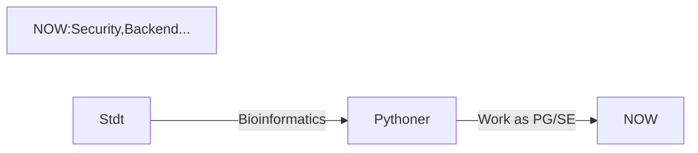

# Summary

**SNS landing page: http://lit.link/myon123**

# Carrer Flow

# Repositories
- [python3nmap_GUI_for_Beginners](https://github.com/myon-bioinformatics/python3nmap_GUI_for_Beginners)
- [myon-bioinformatics.github.io](https://github.com/myon-bioinformatics/myon-bioinformatics.github.io)
- [niconicoSearchAPI_Template](https://github.com/myon-bioinformatics/niconicoSearchAPI_Template)
- [GitHub_api_Template](https://github.com/myon-bioinformatics/GitHub_api_Template)
- [Qiita_API_Template](https://github.com/myon-bioinformatics/Qiita_API_Template)
- [LINENotifyAPI_Template](https://github.com/myon-bioinformatics/LINENotifyAPI_Template)
- [convert_img_fmt_to_webp-CUI-](https://github.com/myon-bioinformatics/convert_img_fmt_to_webp-CUI-)
- [convert_img_fmt_to_webp-GUI-](https://github.com/myon-bioinformatics/convert_img_fmt_to_webp-GUI-)
- [search_seq_including_spaces](https://github.com/myon-bioinformatics/search_seq_including_spaces)
- [scapy_GUI_for_Beginners](https://github.com/myon-bioinformatics/scapy_GUI_for_Beginners)
- [myon-bioinformatics.github.io](https://github.com/myon-bioinformatics/myon-bioinformatics.github.io)

# Top Langs

# My Skill (Programming Languages, Frameworks and Tools)

   

  ※Another skill and tools
  Codeigniter, Virtual Box, CakePHP, CircleCI and so on.

