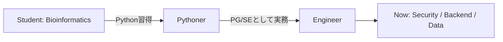

<!-- Centered headline -->
<h1 align="center">🐍 myon-bioinformatics 🎸</h1>

  Security × Backend × Data • Python / Go / TypeScript

  <!-- Badges -->
  
  
  
  

  <a href="https://lit.link/myon123">lit.link</a> •
  <a href="https://linktr.ee/myon123">Linktree</a> •
  <a href="https://myon-bioinformatics.github.io/">Portfolio (GitHub Pages)</a>

---

## 👋 Summary / 自己紹介
- バイオインフォからエンジニアへ。**セキュリティ/ネットワーク**と**バックエンド**が主戦場。  
- GUIツールやテンプレ系の **「すぐ使える」リポジトリ**を多数公開中。  
- 好き：Python、Go、TypeScript、Docker、Wireshark / Scapy、Ghidra、Flutter(Dart)

> _“I build practical tools and templates you can run today.”_

---

## 🧭 Career Flow

```mermaid
flowchart LR
  Stdt[Student: Bioinformatics] -->|Python習得| Pythoner[Pythoner]
  Pythoner -->|PG/SEとして実務| Pro[Engineer]
  Pro --> NOW[Now: Security / Backend / Data]
```

---

## 🧰 Skills

> **Others:** VMware / Security (Scapy, Ghidra, Wireshark) / CUI&GUIツール作成

---

## 📦 Featured Repositories

<!-- “pin” cards: change repo names if you want -->

  
  

  
  

🔎 More repos

* [GitHub\_api\_Template](https://github.com/myon-bioinformatics/GitHub_api_Template)
* [Qiita\_API\_Template](https://github.com/myon-bioinformatics/Qiita_API_Template)
* [LINENotifyAPI\_Template](https://github.com/myon-bioinformatics/LINENotifyAPI_Template)
* [convert\_img\_fmt\_to\_webp-CUI-](https://github.com/myon-bioinformatics/convert_img_fmt_to_webp-CUI-)
* [search\_seq\_including\_spaces](https://github.com/myon-bioinformatics/search_seq_including_spaces)
* [myon-bioinformatics.github.io](https://github.com/myon-bioinformatics/myon-bioinformatics.github.io)
* [HelpYouBuildServer](https://github.com/myon-bioinformatics/HelpYouBuildServer)
* [AttentionToJapaneseBeginners](https://github.com/myon-bioinformatics/AttentionToJapaneseBeginners)
* [flutter\_navigation\_basic](https://github.com/myon-bioinformatics/flutter_navigation_basic)

---

## 📊 Stats

  

---

## 🧑‍💻 What I’m Working On

* セキュリティ検証用GUI/CUIツールの整備
* 使い回せるAPIテンプレ群（GitHub / Qiita / LINE Notifyなど）
* 画像・音声のバッチ変換GUIツール（FFmpegラッパー）

---

## 📫 Contact

* DM: <a href="https://twitter.com/myonitbusiness">@myonitbusiness</a>
* Links: <a href="https://lit.link/myon123">lit.link</a> / <a href="https://linktr.ee/myon123">Linktree</a>

---

## ℹ️ More about me

😏 **詳細はこちら** → <a href="https://myon-bioinformatics.github.io/">myon-bioinformatics.github.io</a>

---

## Claude から PR を作る

### 経路1: Claude Code on the web（リポジトリ設定不要）

1. スマホのブラウザで https://claude.ai/code を開く
2. GitHub 接続を求められたら Claude GitHub App をインストールし、本リポジトリを許可
3. Claude アプリの「Code」タブ → New Session → 本リポジトリとブランチを選択
4. やってほしいことを書いて送信。完了後 diff を確認して「Create a PR」

Pro プランに含まれる。クラウド VM の追加課金は無い（使用量は Claude 全体の枠を共有）。

### 経路2: `@claude` メンション（本リポジトリのワークフロー）

issue や PR のコメントに `@claude` を含めて指示すると
`.github/workflows/claude.yml` が起動する。

事前に必要な設定:

- Claude GitHub App のインストール
- Secret `CLAUDE_CODE_OAUTH_TOKEN` の登録（`claude setup-token` で生成）

`ANTHROPIC_API_KEY` は使わないこと。従量課金になる。

### 経路3: Actions から手動実行（Issue作成など）

1. リポジトリの **Actions** → **Claude** を開く
2. **Run workflow** を押す
3. 指示欄に、たとえば `GitHub Issueを1件作成して。タイトルは「README確認」、本文には確認観点を3つ書いて。` と入力して実行

既存Issueを起点にしない作業をClaudeへ依頼できる。実行結果はActionsのジョブログで確認する。
