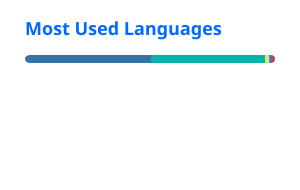

<!-- PRESENTATION:START title -->
<h1 align="center">🐍 myon-bioinformatics 🎸</h1>
<!-- PRESENTATION:END title -->

<!-- HEADER:START -->

  Security × Backend × Data • Python / Go / TypeScript

  <a href="https://lit.link/myon123">lit.link</a> •
  <a href="https://linktr.ee/myon123">Linktree</a> •
  <a href="https://myon-bioinformatics.github.io/">Portfolio (GitHub Pages)</a>

<!-- HEADER:END -->

<!-- PRESENTATION:START badges -->

  
  

  
  

<!-- PRESENTATION:END badges -->

---

<!-- PROFILE:START -->
> **Canonical source:** [profile.json](https://github.com/myon-bioinformatics/myon-bioinformatics.github.io/blob/main/profile.json)
> This section is generated automatically. Edit the canonical JSON instead of this README block.

## 👋 Summary / 自己紹介

Bioinformatics → Security / Backend engineer.  
I design and build practical GUI/CLI tools in Python, plus backend services in Go and TypeScript. My background spans genomic data pipelines, network security tooling, and developer productivity utilities.

> _“I build practical tools and templates you can run today.”_

## 🧭 Career Flow

- **2020 — Started Bioinformatics**: Began working with genomic data pipelines and sequence analysis tools.
- **2021 — Python GUI Tooling**: Built beginner-friendly GUI wrappers for network security tools (Nmap, Scapy).
- **2022 — Security / Backend Focus**: Shifted focus toward security tooling and backend service development.
- **2023– — Multi-language Engineering**: Expanding into Go and TypeScript for backend APIs and developer tooling.

## 🧰 Skills

### Languages
- Python (90%)
- Go (65%)
- TypeScript (60%)
- Bash (70%)

### Domain
- Bioinformatics (85%)
- Network Security (75%)
- Backend / API (65%)
- GUI / Desktop (80%)

### Tools & Infra
- Linux / CLI (85%)
- Docker (60%)
- Git / GitHub (80%)
- Wireshark / Scapy / Ghidra (70%)
- Flutter / Dart (60%)

## 🧑‍💻 What I’m Working On

- Security-oriented GUI / CUI tooling
- Reusable API templates and backend integration patterns
- Image / audio batch conversion and developer utilities

## 📫 Contact

[Portfolio](https://myon-bioinformatics.github.io/) • [GitHub](https://github.com/myon-bioinformatics) • [Twitter](https://twitter.com/myonitbusiness) • [lit.link](https://lit.link/myon123) • [Linktree](https://linktr.ee/myon123)
<!-- PROFILE:END -->

---

<!-- PROJECTS:START -->
## 📦 Featured Repositories

> **Selection source:** [projects.json](https://github.com/myon-bioinformatics/myon-bioinformatics.github.io/blob/main/projects.json) · **Repository facts:** [api/repos.json](https://myon-bioinformatics.github.io/api/repos.json)

### [python3nmap_GUI_for_Beginners](https://github.com/myon-bioinformatics/python3nmap_GUI_for_Beginners)

Beginner-friendly Nmap GUI wrapper (Python + PySimpleGUI).

`python` `security` `gui` `nmap`

### [scapy_GUI_for_Beginners](https://github.com/myon-bioinformatics/scapy_GUI_for_Beginners)

Packet crafting/inspection via GUI for newcomers.

`python` `scapy` `networking` `gui`

### [convert_img_fmt_to_webp-GUI-](https://github.com/myon-bioinformatics/convert_img_fmt_to_webp-GUI-)

Batch image conversion to WebP with a friendly UI (FFmpeg wrapper).

`python` `ffmpeg` `image` `gui`

### [niconicoSearchAPI_Template](https://github.com/myon-bioinformatics/niconicoSearchAPI_Template)

Template to kickstart API-based search clients.

`template` `api` `starter`

🔎 More repos

* [Aoi](https://github.com/myon-bioinformatics/Aoi)
* [ascii_artist](https://github.com/myon-bioinformatics/ascii_artist)
* [AttentionToJapaneseBeginners](https://github.com/myon-bioinformatics/AttentionToJapaneseBeginners)
* [audio_any2any_gui](https://github.com/myon-bioinformatics/audio_any2any_gui)
* [browser-test-kit](https://github.com/myon-bioinformatics/browser-test-kit)
* [cli_args](https://github.com/myon-bioinformatics/cli_args)
* [convert_img_fmt_to_webp-CUI-](https://github.com/myon-bioinformatics/convert_img_fmt_to_webp-CUI-)
* [cumlative_usage](https://github.com/myon-bioinformatics/cumlative_usage)
* [flutter_navigation_basic](https://github.com/myon-bioinformatics/flutter_navigation_basic)
* [gh_identity](https://github.com/myon-bioinformatics/gh_identity)
* [GitHub_api_Template](https://github.com/myon-bioinformatics/GitHub_api_Template)
* [HelpYouBuildServer](https://github.com/myon-bioinformatics/HelpYouBuildServer)
* [image_ext_converter_gui](https://github.com/myon-bioinformatics/image_ext_converter_gui)
* [Ironmate](https://github.com/myon-bioinformatics/Ironmate)
* [LINENotifyAPI_Template](https://github.com/myon-bioinformatics/LINENotifyAPI_Template)
* [markdown](https://github.com/myon-bioinformatics/markdown)
* [mcp-toolcall-lab](https://github.com/myon-bioinformatics/mcp-toolcall-lab)
* [mock_server_JS](https://github.com/myon-bioinformatics/mock_server_JS)
* [myon-bioinformatics.github.io](https://github.com/myon-bioinformatics/myon-bioinformatics.github.io)
* [nvd_nist_known_vulns](https://github.com/myon-bioinformatics/nvd_nist_known_vulns)
* [oci-cost-analysis](https://github.com/myon-bioinformatics/oci-cost-analysis)
* [Qiita_API_Template](https://github.com/myon-bioinformatics/Qiita_API_Template)
* [search_seq_including_spaces](https://github.com/myon-bioinformatics/search_seq_including_spaces)
* [video_to_image_gui](https://github.com/myon-bioinformatics/video_to_image_gui)
* [video2audio_gui](https://github.com/myon-bioinformatics/video2audio_gui)
* [vlm_ocr_jp_gui](https://github.com/myon-bioinformatics/vlm_ocr_jp_gui)
* [web-ui](https://github.com/myon-bioinformatics/web-ui)
* [xprobe](https://github.com/myon-bioinformatics/xprobe)
* [yourself](https://github.com/myon-bioinformatics/yourself)

<!-- PROJECTS:END -->

---

<!-- PRESENTATION:START stats -->
## 📊 Stats

  

  

<!-- PRESENTATION:END stats -->

---

<!-- FOOTER:START -->
## ℹ️ More about me

😏 **詳細はこちら** → <a href="https://myon-bioinformatics.github.io/">myon-bioinformatics.github.io</a>
<!-- FOOTER:END -->

---

## Shared GitHub operations

`gh_ops.py` is the canonical stdlib-only GitHub operation CLI migrated from
browser-test-kit, with its unit/parity tests owned here. See [the contract](docs/gh-ops.md).
Consumers enroll the source/LICENSE via `vendor_sync` and keep only integration
checks, rather than maintain generic operation implementations or duplicate tests.

## Shared tooling and evidence

This repository also owns reusable CI workflows and stdlib-only tooling for
sibling repositories. It is both the profile README and the parent tooling repo.

| Capability | Entry point / contract | Consumer responsibility |
| --- | --- | --- |
| Git inspection | [git_inspector.py](git_inspector.py), [contract](docs/git-inspector.md) | Request observations; keep repository-specific presentation local |
| Vendor placement and artifact staging | [vendor_sync.py](vendor_sync.py), [vendor_stage.py](vendor_stage.py), [guide](docs/vendor-automation.md) | Enroll exact source/LICENSE bytes and an explicit lock; use the parent stager |
| GitHub workflow operations | [gh_workflow.py](gh_workflow.py), [guide](docs/gh-workflow.md) | Keep explicit write preconditions and repository-specific orchestration |
| JUnit failure identity | [reusable collector](.github/workflows/reusable-junit-identity.yml), [contract](docs/junit-identity.md) | Produce raw XML, preserve the test exit code, and configure exact expected report paths |
| Browser screenshot evidence | [browser_evidence.py](browser_evidence.py), [contract](docs/browser-evidence.md) | Capture screenshots with the consumer's engine runner; supply run and checkout identity |
| TypeScript compiler policy | [policy](docs/typescript-native-policy.md) | Policy only; pin a compatible stable release and validate each consumer at the same head |

The parent's [Python tests workflow](.github/workflows/python-tests.yml) collects
JUnit from five Python versions (3.10–3.14) and three vendor-portability jobs
(Linux 3.9, Windows 3.12, macOS 3.12). Raw XML and compact failure identity are
separate artifacts: raw XML is retained for 14 days, while compact artifacts use
repository-default retention. A complete collection does not turn a
failed producer job green, and a green run may have an empty failure corpus.

Browser evidence currently provides a **contract only**. Shared Playwright and
Stagehand execution adapters are not implemented here yet; consumer capture
runners must remain until their replacement is verified. Repository metadata's
contract/generator pair is still maintained in
[Ironmate](https://github.com/myon-bioinformatics/Ironmate/blob/main/docs/repository-metadata-portability.md).

The organization-wide target survey is in [docs/vendor-target-inventory.json](docs/vendor-target-inventory.json).
Single-file candidates are catalogued even when they require an explicit skip:
`default_enrollment` records a machine-readable default for every consumer;
individual `consumers` entries override it. When absent, the original
`default_single_file_policy` enrollment remains unchanged. Archived applications,
external-package applications and parent-managed vendor tools are not implicitly
placed into consumer trees. See [catalog coverage](docs/vendor-catalog-coverage.md).
